# Frontend Documentation - ADP

## Project Structure

The ADP frontend is built using Vue.js and includes several important features:

### 1. Dark/Light Mode

The site supports two themes:

- **Light Mode**: Default theme
- **Dark Mode**: For better experience in dark environments

Theme switching can be done through a button in the top-right corner of the screen.

### 3. Internationalization (i18n)

The site supports multiple languages through Vue I18n:

- **Portuguese (pt)**: Default language
- **English (en)**: Alternative option

Translations are organized in separate files:
- `src/i18n/pt.ts` - Portuguese translations
- `src/i18n/en.ts` - English translations

## Technologies Used

- Vue.js
- TypeScript
- Axios
- Vue I18n
- Tailwind CSS
- Vite

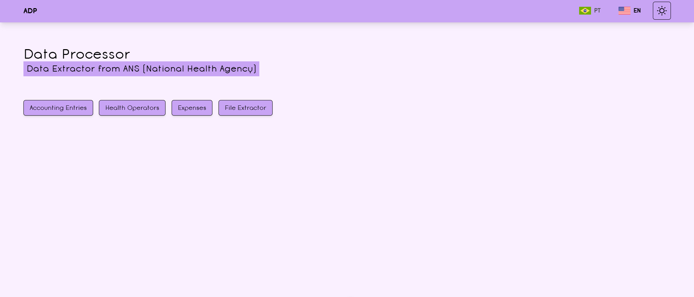
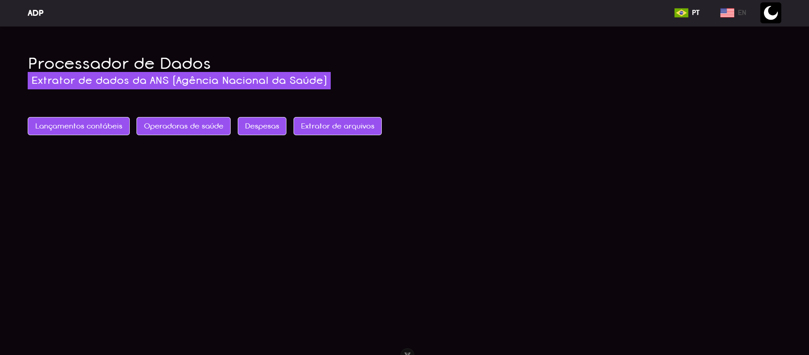
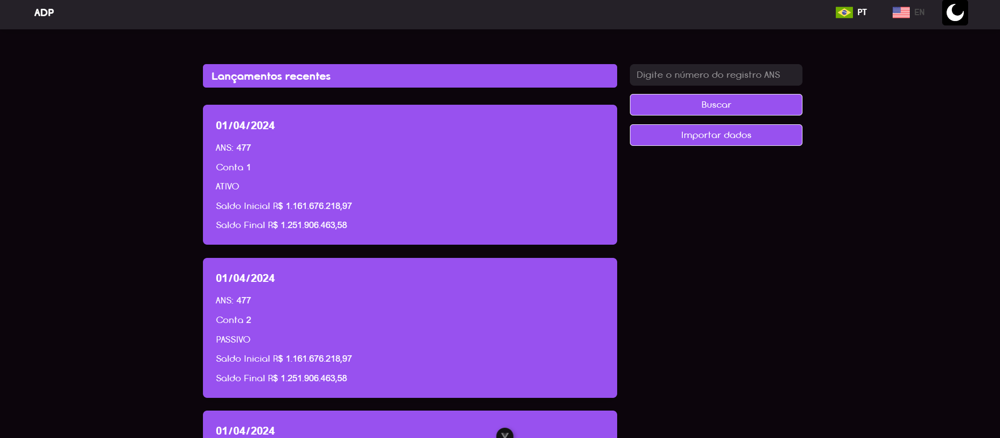
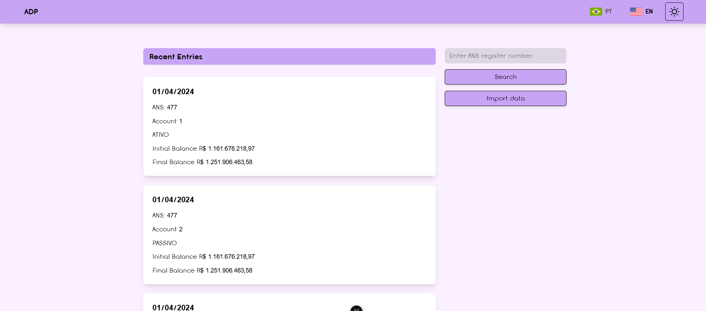
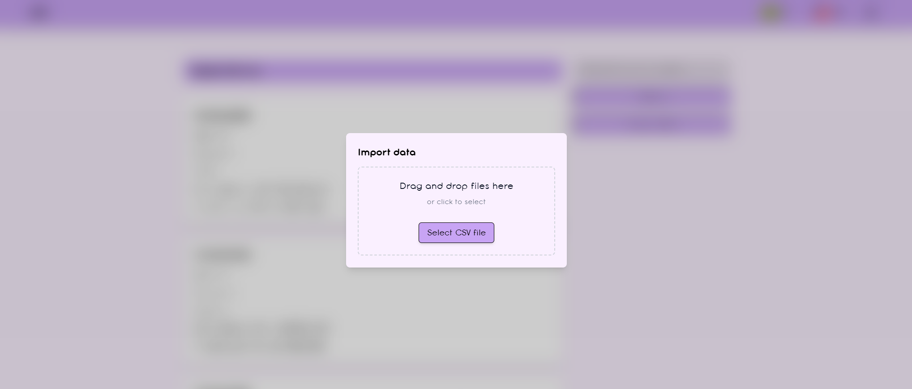

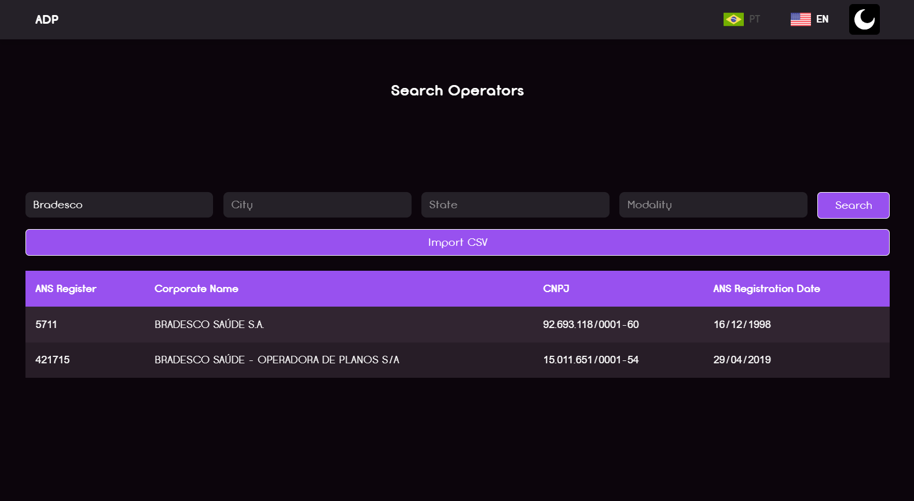
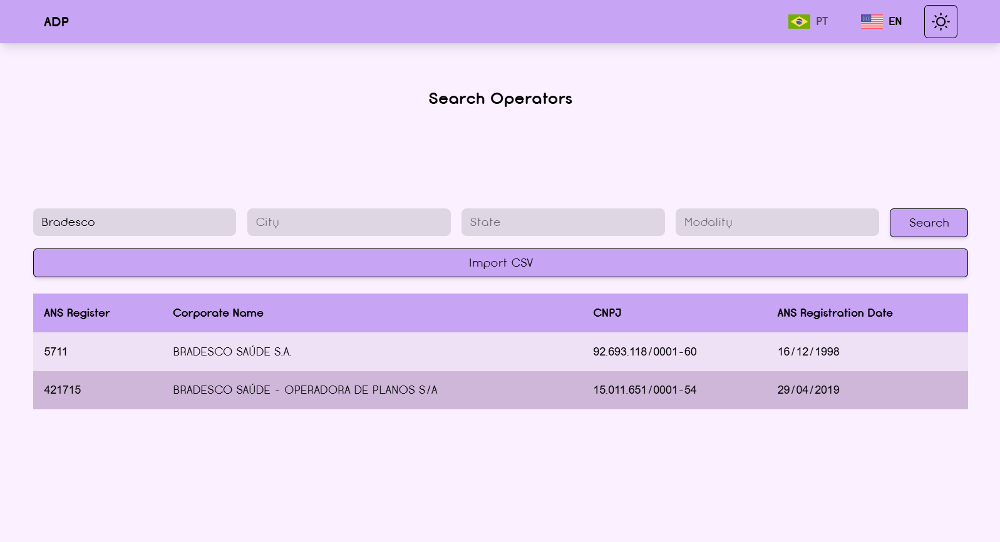
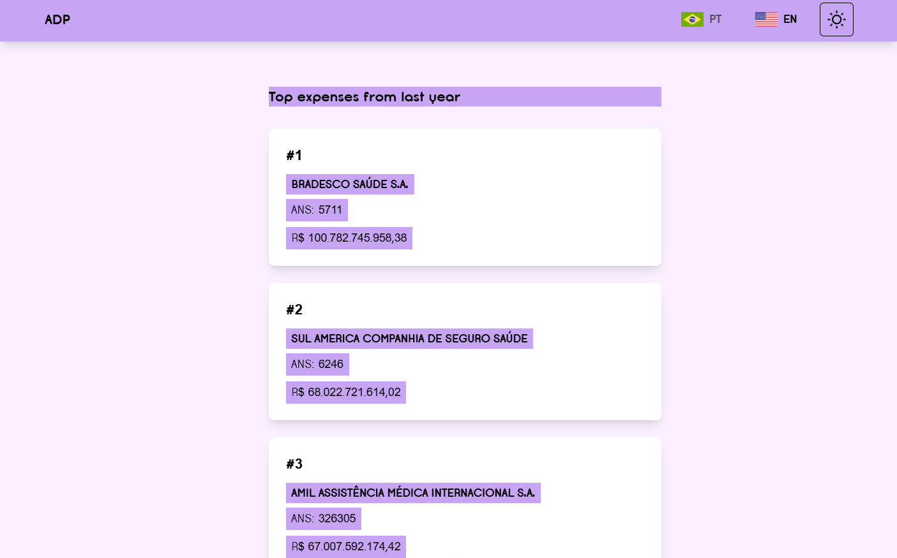
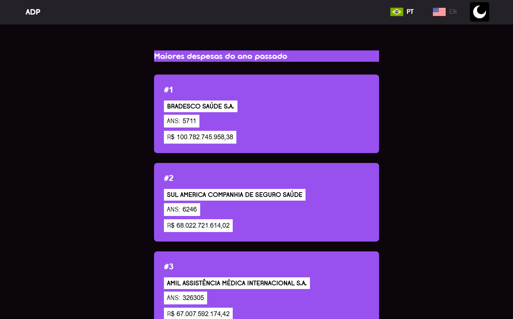
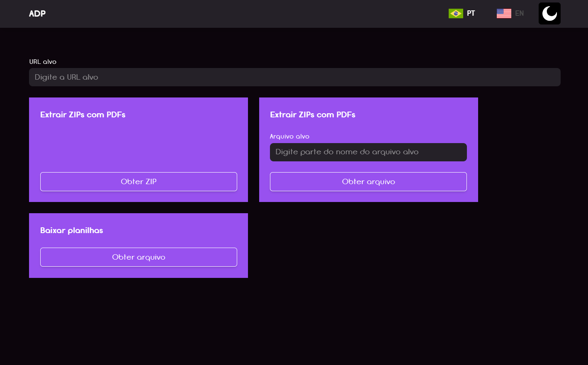
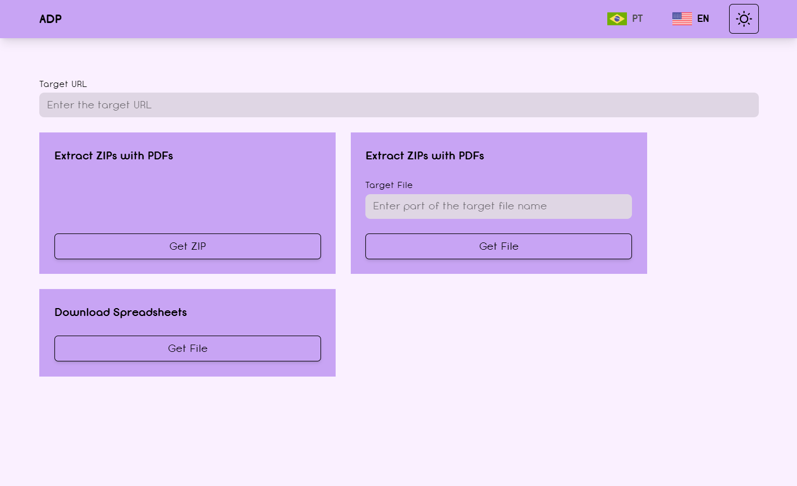
