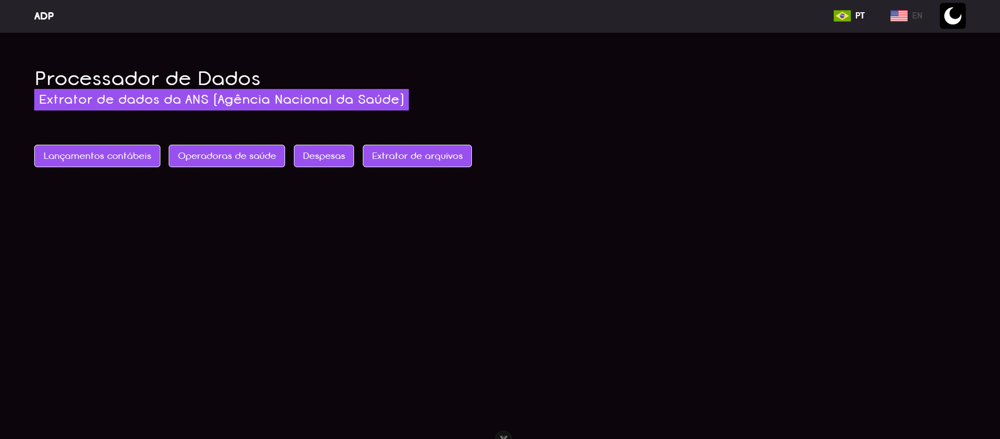
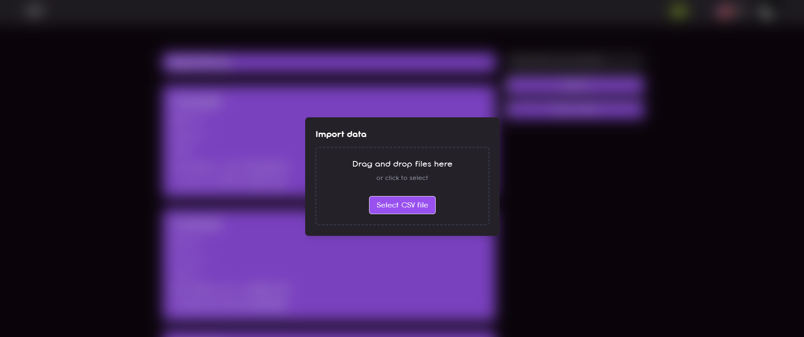
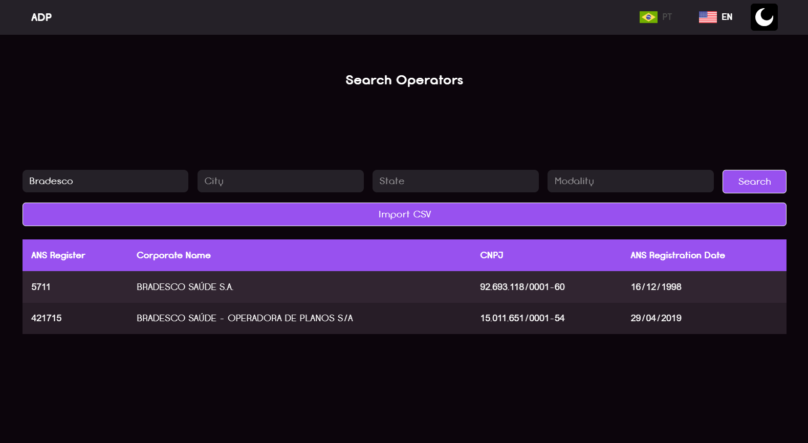
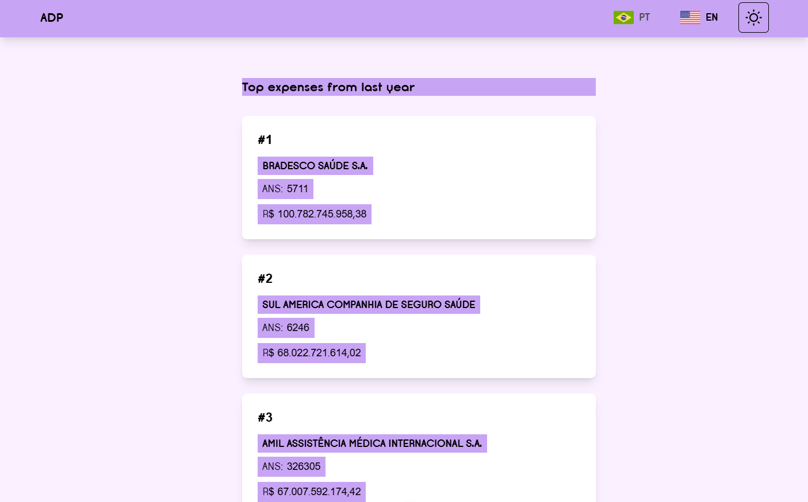
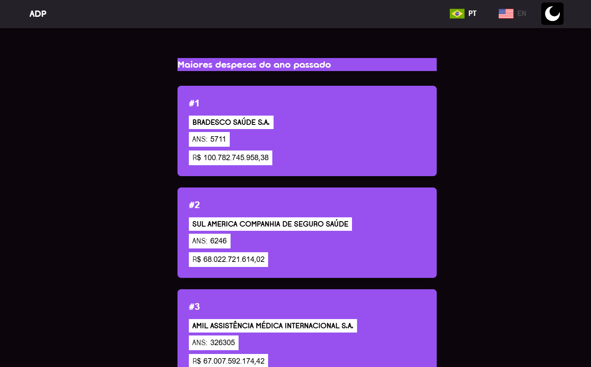
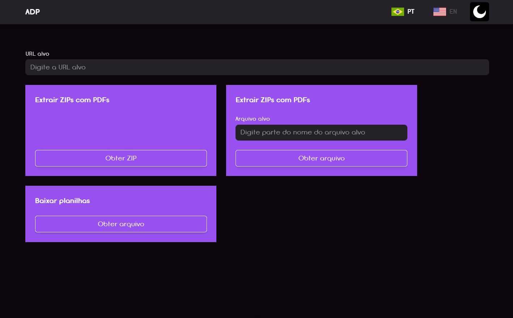

# Documentação do Frontend - ADP  

## Estrutura do Projeto  

O frontend do ADP é desenvolvido usando Vue.js e inclui diversos recursos importantes:  

### 1. Modo Claro/Escuro  

O site suporta dois temas:  

- **Modo Claro**: Tema padrão  
- **Modo Escuro**: Para uma melhor experiência em ambientes escuros  

A troca de tema pode ser feita por meio de um botão no canto superior direito da tela.  

### 2. Internacionalização (i18n)  

O site suporta vários idiomas por meio do Vue I18n:  

- **Português (pt)**: Idioma padrão  
- **Inglês (en)**: Opção alternativa  

As traduções estão organizadas em arquivos separados:  
- `src/i18n/pt.ts` - Traduções em português  
- `src/i18n/en.ts` - Traduções em inglês  

## Tecnologias Utilizadas  

- Vue.js  
- TypeScript  
- Axios  
- Vue I18n  
- Tailwind CSS  
- Vite  

  
  
  
  
  
  
  
  
  
  
  
  